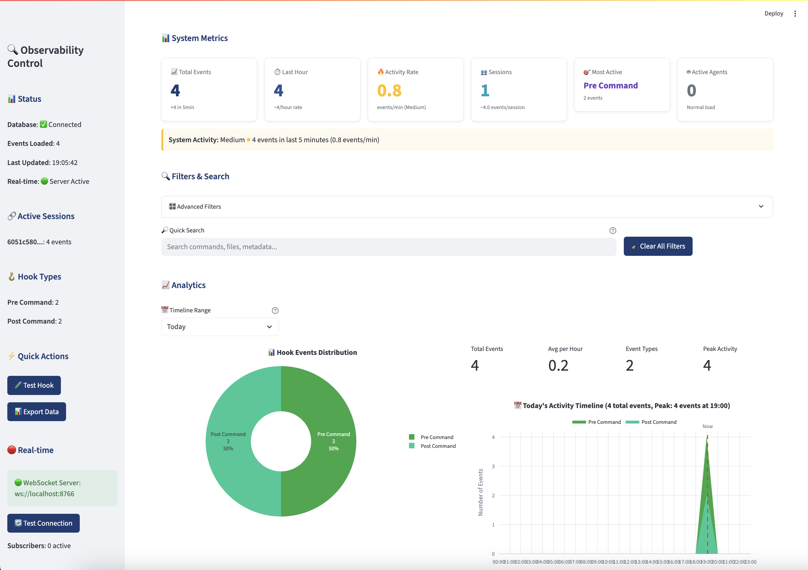
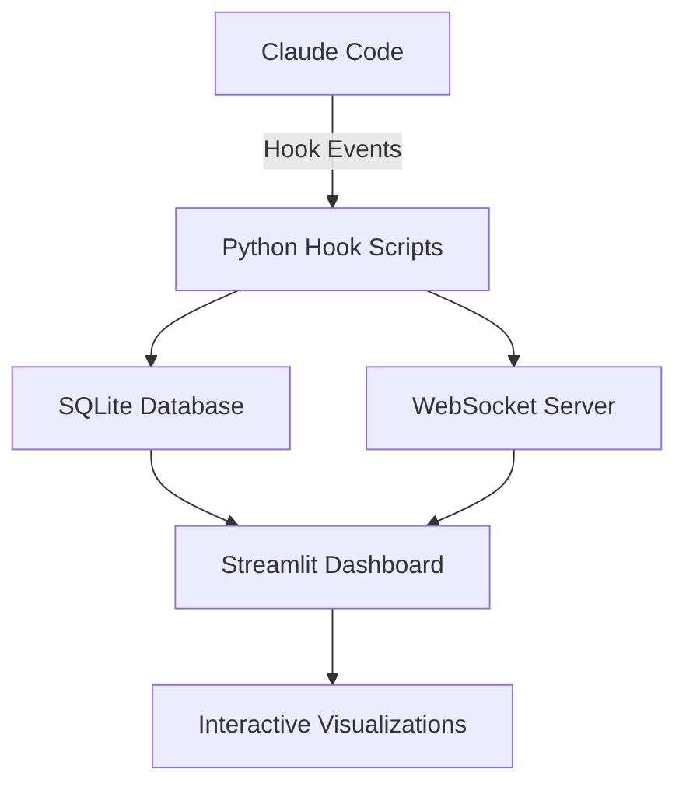

# 🦁 khive_claude

Real-time monitoring and observability for Claude Code hook events. This project demonstrates how to use Claude Code's hook system to capture, store, and visualize all tool interactions in real-time.

[](https://www.python.org/downloads/)
[](https://opensource.org/licenses/MIT)

## 🎯 Purpose

Claude Code provides a powerful hook system that allows you to intercept and monitor all tool interactions. This project shows you how to:

- 🪝 Set up Claude Code hooks for comprehensive monitoring
- 📊 Capture and store all tool events in a SQLite database
- 📈 Visualize activity patterns with an interactive dashboard
- 🔴 Stream events in real-time via WebSocket
- 🔍 Analyze usage patterns and system behavior

## 🚀 Quick Start

### 1. Install khive_claude

```bash
# Clone the repository
git clone https://github.com/khive-ai/khivedev.git
cd khive_claude

# Install with uv (recommended)
uv pip install -e .

# Or with pip
pip install -e .
```

### 2. Configure Claude Code Hooks

Add the following to your `.claude/settings.json`:

```json
{
  "UserPromptSubmit": {
    "command": "uv run python -m khive_claude.hooks.prompt_submitted"
  },
  "PreToolUse": [
    {
      "matcher": "Bash",
      "hooks": [{
        "type": "command",
        "command": "uv run python -m khive_claude.hooks.pre_command"
      }]
    },
    {
      "matcher": "Edit|MultiEdit|Write",
      "hooks": [{
        "type": "command",
        "command": "uv run python -m khive_claude.hooks.pre_edit"
      }]
    },
    {
      "matcher": "Task",
      "hooks": [{
        "type": "command",
        "command": "uv run python -m khive_claude.hooks.pre_agent_spawn"
      }]
    }
  ],
  "PostToolUse": [
    {
      "matcher": "Bash",
      "hooks": [{
        "type": "command",
        "command": "uv run python -m khive_claude.hooks.post_command"
      }]
    },
    {
      "matcher": "Edit|MultiEdit|Write",
      "hooks": [{
        "type": "command",
        "command": "uv run python -m khive_claude.hooks.post_edit"
      }]
    },
    {
      "matcher": "Task",
      "hooks": [{
        "type": "command",
        "command": "uv run python -m khive_claude.hooks.post_agent_spawn"
      }]
    }
  ],
  "Notification": {
    "command": "uv run python -m khive_claude.hooks.notification"
  }
}
```

### 3. Start the Dashboard

```bash
uv run python -m khive_claude.cli dashboard --port 8502
```

Open http://localhost:8502 in your browser to see real-time monitoring!

## 📊 Features

### Real-time Monitoring Dashboard



- **System Metrics**: Track total events, activity rate, active sessions, and agent load
- **Hook Distribution**: Visualize which hooks are triggered most frequently
- **Activity Timeline**: See activity patterns over different time ranges (Today, Last 7 Days, etc.)
- **Event History**: Browse all captured events with filtering and search
- **WebSocket Streaming**: Optional real-time event streaming

### Hook Events Captured

| Hook Type | Description | Data Captured |
|-----------|-------------|---------------|
| **UserPromptSubmit** | User submits a prompt | Word count, complexity, timestamp |
| **Pre/Post Command** | Bash command execution | Command, output, execution time |
| **Pre/Post Edit** | File modifications | File paths, changes made |
| **Pre/Post Agent Spawn** | Task agent operations | Task description, agent details |
| **Notification** | System notifications | Severity, message content |

## 🛠️ Architecture



### Components

1. **Hook Scripts** (`src/khive_claude/hooks/`): Lightweight Python scripts that capture events
2. **Database Adapter** (`src/khive_claude/adapters/`): Async SQLite storage with Pydantic models
3. **Dashboard** (`src/khive_claude/frontend/`): Streamlit-based real-time monitoring
4. **WebSocket Server** (optional): Real-time event streaming
5. **CLI** (`src/khive_claude/cli.py`): Command-line interface

## 🔧 Configuration

### Environment Variables

```bash
# Dashboard configuration
export KHIVE_REFRESH_RATE=5          # Auto-refresh interval (seconds)
export KHIVE_MAX_EVENTS=500          # Maximum events to display
export KHIVE_DEFAULT_TIME_RANGE=Today # Default timeline view
export KHIVE_ENABLE_WEBSOCKET=true    # Enable WebSocket support
export KHIVE_WEBSOCKET_PORT=8766      # WebSocket server port
```

### Database Location

Events are stored in: `~/.khive_claude/events.db`

## 📚 Usage Examples

### Basic Monitoring

```bash
# Start the dashboard
uv run python -m khive_claude.cli dashboard

# Check status
uv run python -m khive_claude.cli status

# Start WebSocket server (optional)
uv run python -m khive_claude.cli server --port 8766
```

### Analyzing Events

The dashboard provides:

- **Filtering**: Filter by event type, tool, session, or time range
- **Search**: Search across commands, file paths, and metadata
- **Export**: Download events as CSV for external analysis
- **Timeline**: View activity patterns over different time periods

### Custom Hook Development

Create your own hooks by following the pattern in `src/khive_claude/hooks/`:

```python
#!/usr/bin/env python3
import json
import sys
from khive_claude.hooks.hook_event import HookEvent, HookEventContent

def handle_custom_hook(data):
    event = HookEvent(
        content=HookEventContent(
            event_type="custom_hook",
            tool_name=data.get("tool_name"),
            metadata={"custom": "data"}
        )
    )
    
    # Save event asynchronously
    import asyncio
    asyncio.run(event.save())
    
    # Return result to Claude Code
    return {"proceed": True}

if __name__ == "__main__":
    hook_input = json.load(sys.stdin)
    result = handle_custom_hook(hook_input)
    print(json.dumps(result))
    sys.exit(0 if result.get("proceed", True) else 1)
```

## 🤝 Contributing

Contributions are welcome! Please feel free to submit a Pull Request.

1. Fork the repository
2. Create your feature branch (`git checkout -b feature/AmazingFeature`)
3. Commit your changes (`git commit -m 'Add some AmazingFeature'`)
4. Push to the branch (`git push origin feature/AmazingFeature`)
5. Open a Pull Request

## 📖 Documentation

- [Dashboard Guide](docs/DASHBOARD.md) - Detailed dashboard documentation
- [Hook System](docs/HOOKS.md) - Understanding Claude Code hooks
- [API Reference](docs/API.md) - Database and event models

## 🐛 Troubleshooting

### Common Issues

1. **"Hook not triggering"**: Ensure your `.claude/settings.json` is properly formatted
2. **"Database error"**: Check write permissions for `~/.khive_claude/`
3. **"Dashboard not updating"**: Verify hooks are configured and Claude Code is restarted

### Debug Mode

Enable debug logging:
```bash
export KHIVE_DEBUG=true
```

## 📝 License

This project is licensed under the MIT License - see the [LICENSE](LICENSE) file for details.

## 🙏 Acknowledgments

- Built for [Claude Code](https://github.com/anthropics/claude-code) by Anthropic
- Dashboard powered by [Streamlit](https://streamlit.io/)
- Charts by [Plotly](https://plotly.com/)

## 👤 Author

**Ocean** (HaiyangLi)
- GitHub: [@ohdearquant](https://github.com/ohdearquant)
- Project: [khive-ai](https://github.com/khive-ai)

---

Made with ❤️ to help developers understand and leverage Claude Code's powerful hook system.
