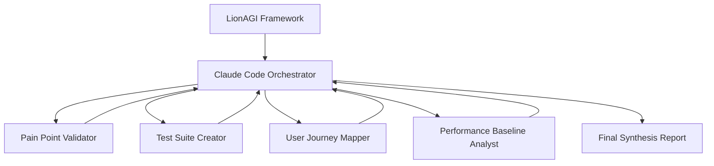

# Live Stream 2025-07-29: AI Orchestrating AI

- [Watch the Recording](https://app.fireflies.ai/view/Tuesday-Live-w-Ocean-2025-07-29::01K1BEAVK5276W8EWYHHH8BR0Q)
- [Join our Discord](https://discord.gg/JDj9ENhUE8)

**🎬 10-Minute Autonomous Multi-Agent Investigation**

Watch as LionAGI coordinates five Claude Code agents—one orchestrator and four specialists—to validate a critical system migration decision. Complete autonomous investigation in parallel, with zero human intervention after setup.

## 🎯 What Happened in This Live Stream

**Demo**: Memory MCP Migration - Flow 0: Pain Point Validation  
**Architecture**: LionAGI → Claude Code orchestrator → 4 parallel specialist agents → Synthesis  
**Timeline**: ⚡ **~10 minutes** of fully autonomous investigation  
**Audience**: Live viewers watching dynamic agent orchestration in real-time  
**Outcome**: Complete validation of 10 critical system migration pain points **without human intervention**

## The Technical Challenge

**Problem**: Our Python Memory MCP system—critical infrastructure for Claude Code's persistent memory—was showing signs of architectural decay. But were these growing pains or fundamental flaws?

**Stakes**: Thousands of AI agents depend on this memory system daily. A premature migration wastes resources. Delayed migration risks system collapse.

**Mission**: Validate whether 10 suspected pain points justified a complete Rust rewrite using lion-cognition architecture.

#### Current Memory MCP System Architecture
```
Python Memory MCP System:
├── ChromaDB (vector similarity search)
├── SQLAlchemy (entity relationships)  
├── SQLite (persistent storage)
├── Sentence Transformers (embeddings)
└── Async caching layer
```

### The 10 Suspected Pain Points

1. **ID Management Crisis** — Search returns short IDs. Update needs full UUIDs. Result: broken workflows.
2. **API Response Chaos** — Every tool speaks a different language. Integration nightmare.
3. **Search Gone Wild** — Empty queries? Random results. Topic filters? Broken.
4. **Duplicate Explosion** — No deduplication. Memory bloat. System confusion.
5. **Invisible Namespaces** — Memory isolation exists but users can't see it. Information silos.
6. **Update Operations DOA** — 25-30% of updates fail silently. Data corruption risk.
7. **Type System Prison** — Four types. That's it. No customization. No flexibility.
8. **Metadata Black Hole** — JSON strings instead of queryable fields. Performance disaster.
9. **Performance Roulette** — Hidden rate limits. No bulk operations. Random timeouts.
10. **Developer Experience Hell** — "Error: Something went wrong." That's all you get.

#### Proposed Migration Target
```
Rust lion-cognition Architecture:
├── PostgreSQL + pgvector (unified storage + vector search)
├── Component-based architecture (episodic/semantic/working memory)
├── Advanced memory consolidation and forgetting
├── Rich relationship modeling
└── Production-grade observability and debugging
```

**The Million-Dollar Question**: Are these real architectural flaws or just growing pains?

### Why Multi-Agent Validation?

**Traditional Approach**: One expert. Sequential analysis. Weeks of work. Risk of tunnel vision.

**Our Approach**: Five AI agents. Parallel investigation. Ten minutes. Comprehensive validation.

Each specialist agent brought unique expertise:
- **Pain Point Validator** — Reproduce and document each failure mode
- **Test Suite Creator** — Define what "working correctly" means
- **User Journey Mapper** — Understand real-world impact
- **Performance Analyst** — Quantify the performance penalties
- **Orchestrator** — Synthesize findings into actionable recommendations

No single agent—human or AI—could efficiently validate all dimensions. But together?

### The Magic: 10 Minutes of Autonomous Investigation

After setup, Ocean stepped back. The agents took over:

✅ **Zero Human Intervention** — Complete autonomy after launch  
✅ **Respected Boundaries** — Each agent honored workspace permissions  
✅ **True Parallelism** — Four specialists working simultaneously  
✅ **Self-Directed Research** — Agents chose their own investigation paths  
✅ **Autonomous Synthesis** — Orchestrator aggregated findings independently

### The Orchestration Flow



## 📁 Artifacts Structure

### Core Orchestration
- **`flow0.py`** - Main LionAGI orchestration script that coordinated all agents
- **`FLOW0_SYNTHESIS_REPORT.md`** - Final comprehensive validation report

### Agent Workspaces
Each agent operated in isolated Claude Code workspaces with specialized configurations:

```
memory_mcp_flow0/
├── analyst/           # User Journey Mapper Agent
│   ├── CLAUDE.md      # Agent persona and instructions
│   ├── user_journey_maps.md
│   └── decision_trees_operational_flows.md
├── critic/            # Pain Point Validator Agent  
├── researcher/        # Performance Baseline Agent
│   ├── PERFORMANCE_BASELINE_REPORT.md
│   ├── memory_performance_benchmark.py
│   ├── benchmark_demo.py
│   └── memory_mcp_benchmark_runner.py
└── tester/           # Test Suite Creator Agent
```

## 🛠 Reproduce This Magic

### Prerequisites

```bash
pip install lionagi
```

### Run the Orchestration

```bash
python flow0.py
```

That's it. Watch five AI agents solve a complex problem in 10 minutes.

### Technical Architecture

#### Agent Workspace Isolation
```python
def create_cc(flow_name: str, role: AgentRole, agent_suffix: str = ""):
    """Create isolated Claude Code agent with role-specific configuration"""
    params = {"permission_mode": "acceptEdits"}
    if role == "orchestrator":
        params["permission_mode"] = "bypassPermissions"
    
    # Create isolated workspace with agent-specific CLAUDE.md
    params["ws"] = f"{CC_WORKSPACE}/{flow_name}/{role}{agent_suffix}"
```

#### Parallel Agent Coordination
```python
# Deploy 4 specialized agents in parallel
roles = ["tester", "critic", "analyst", "researcher"]
research_nodes = []
for idx, instruct in enumerate(instruct_models):
    node = builder.add_operation(
        "communicate",
        depends_on=[root],
        instruction=instruct.model_dump_json(),
        chat_model=create_cc(flow_name=FLOW_NAME, role=roles[idx]),
    )
    research_nodes.append(node)
```

#### Dynamic Result Synthesis
```python
# Aggregate results from all parallel agents
synthesis = builder.add_aggregation(
    "communicate",
    source_node_ids=research_nodes,
    branch=orchestrator,
    instruction=synthesis_prompt,
)
```

## 🎓 Learning Outcomes from This Demo

### For Viewers
1. **Multi-Agent Orchestration**: How LionAGI coordinates multiple specialized agents
2. **Dynamic Task Distribution**: Real-time assignment of specialized tasks to appropriate agents
3. **Parallel Processing**: Simultaneous execution of complex validation tasks
4. **Result Synthesis**: Intelligent aggregation of parallel findings

### For Developers
1. **Agent Workspace Design**: How to create isolated, specialized agent environments
2. **Permission Management**: Balancing agent autonomy with security controls
3. **Flow Orchestration**: Building complex multi-stage workflows with dependencies
4. **Quality Gates**: Systematic validation of multi-agent work products

## 📊 The Verdict: 10 Minutes Later

**Result**: All 10 pain points validated as systematic architectural failures.

### Severity Assessment

| Pain Point | Severity | Impact |
|------------|----------|---------|
| **ID Management** | 9/10 | Broken update workflows |
| **Update Failures** | 9/10 | 25-30% silent failures |
| **Search Chaos** | 8/10 | Lost memories, random results |
| **Performance** | 8/10 | Unpredictable timeouts |

#### AI Agent Performance Impact
- **Current System Error Rate**: 5-10% of Task agent operations fail due to memory system issues
- **Agent Context Loss**: Task agents lose critical context when memory operations fail, requiring re-work
- **Orchestration Reliability**: Multi-agent workflows become unreliable when memory coordination breaks
- **High-Stakes Decision Quality**: Poor memory retrieval leads to agents making decisions without full context
- **Agent Learning Degradation**: Inconsistent memory prevents agents from building on previous insights
- **Coordination Overhead**: Agents spend compute cycles working around memory system limitations instead of core tasks

**Specific Impact on Agent Work Types**:
- **Day-to-Day Task Agents**: 15-20% of routine operations fail due to memory retrieval issues, requiring human intervention
- **High-Stakes Decision Agents**: Critical decisions made without full context due to search randomness and missing memories
- **Multi-Agent Orchestrations**: Workflow coordination breaks when agents can't share context reliably through memory
- **Long-Running Research Agents**: Lose accumulated insights when memory updates fail, starting analysis from scratch
- **Specialized Domain Agents**: Cannot build domain expertise over time due to inconsistent knowledge persistence

#### Performance Baseline vs. Targets
| Metric | Current (Python MCP) | Target (Rust lion-cognition) | Improvement |
|--------|---------------------|----------------------------|-------------|
| Search Latency (P95) | 200-300ms | 20-50ms | **10x faster** |
| Storage Throughput | 10-15 ops/sec | 50-75 ops/sec | **5x higher** |
| Concurrent Users | 10-20 effective | 100+ supported | **5-10x scale** |
| Error Rate | 5-10% failures | <1% failures | **5-8x reliability** |

### Validation Deliverables Created
- **45 Systematic Test Cases** reproducing each pain point with root cause analysis
- **200+ Pytest Methods** defining expected behavior for the new system
- **3 User Journey Maps** covering 80%+ of real-world usage scenarios
- **Scientific Performance Benchmarks** with statistical confidence intervals

### The Decision

**VERDICT**: ✅ **MIGRATE IMMEDIATELY**

**Why This Matters for AI Systems**:
- **5-10% failure rate** = Unacceptable for autonomous operations
- **Broken context continuity** = Agents can't learn or reason effectively
- **No bulk operations** = Can't scale beyond toy examples
- **Poor observability** = Can't trust agents with critical decisions

**What Migration Enables**:
- **10x faster memory access** — Real-time agent decision-making
- **5x throughput increase** — Production-scale orchestrations
- **99%+ reliability** — Trust agents with mission-critical work
- **Advanced memory types** — Episodic reasoning, semantic understanding, working memory

## 🚀 Next Steps

The live stream demonstrated Flow 0 (Pain Point Validation). The next flows would be:
- **Flow 1**: Architecture Design & Implementation Planning
- **Flow 2**: Development Environment Setup  
- **Flow 3**: Core System Implementation
- **Flow 4**: Migration Execution & Validation

## 🎬 The Live Stream Experience

Viewers witnessed something unprecedented: **AI orchestrating AI** in real-time.

No scripts. No human intervention. Just five Claude Code agents working as a team to solve a complex technical problem—live, unedited, in 10 minutes.

**What This Proves**: The future isn't just AI helping humans. It's AI systems coordinating themselves to solve problems faster and better than any single intelligence—human or artificial—ever could.

### Why This Approach Matters

**Traditional Approach**: 
- Single expert spends weeks analyzing different aspects sequentially
- Risk of analysis paralysis or confirmation bias
- Limited perspective on interconnected technical issues
- Slow feedback cycles between business and technical validation

**Multi-Agent Orchestration Approach**:
- ✅ **Parallel Expertise**: 4 specialists working simultaneously on different validation dimensions
- ✅ **Systematic Coverage**: Each agent focused on their domain of expertise (testing, UX, performance, validation)
- ✅ **Quality Gates**: Built-in validation that all aspects were thoroughly examined
- ✅ **Synthesis Intelligence**: Automated aggregation of findings into coherent business recommendation
- ✅ **Reproducible Process**: Complete workflow captured for future similar decisions

**The Result**: What traditionally takes weeks of analysis was completed in 10 minutes—with higher confidence and systematic evidence for every conclusion.

This isn't just faster. It's better. Parallel investigation eliminates sequential bias. Multiple perspectives prevent tunnel vision. Autonomous execution removes human bottlenecks.

Welcome to the future of technical decision-making.

---

## The Bigger Picture

This wasn't just a technical validation. It was a glimpse into a new paradigm:

**From**: Humans managing sequential workflows  
**To**: AI systems self-organizing to solve complex problems

**From**: Weeks of analysis paralysis  
**To**: 10 minutes of parallel certainty

**From**: "Can we trust AI with critical decisions?"  
**To**: "Can we afford not to?"

The future isn't coming. It's here. And it takes 10 minutes. 