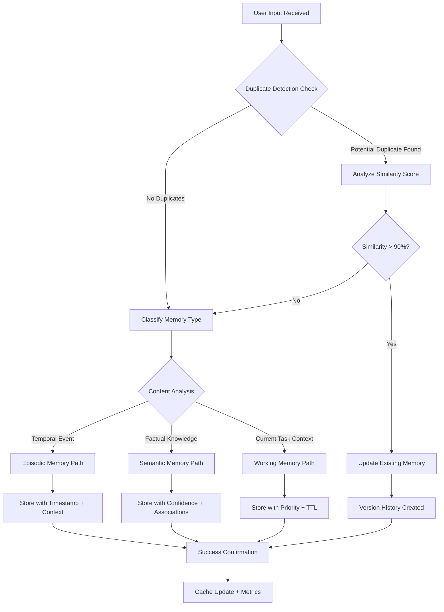
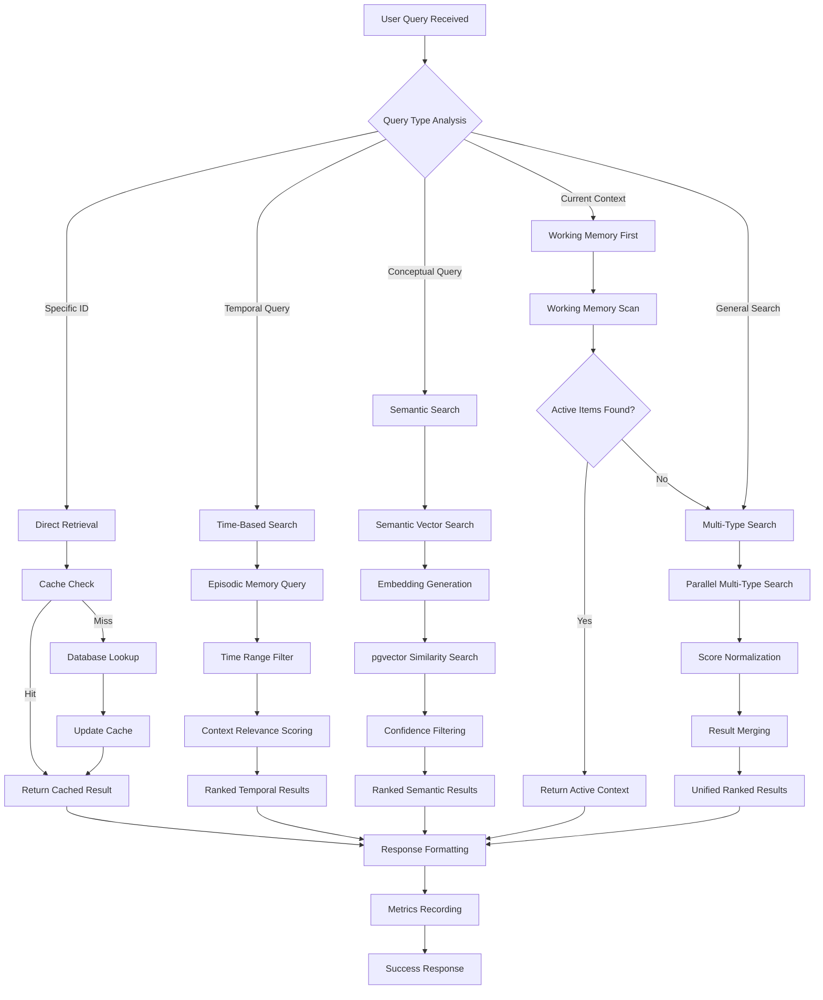
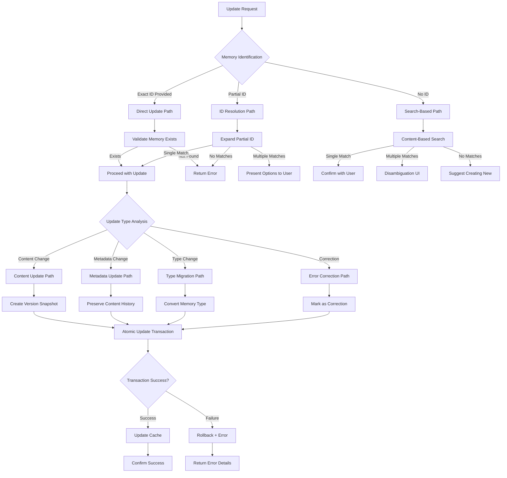
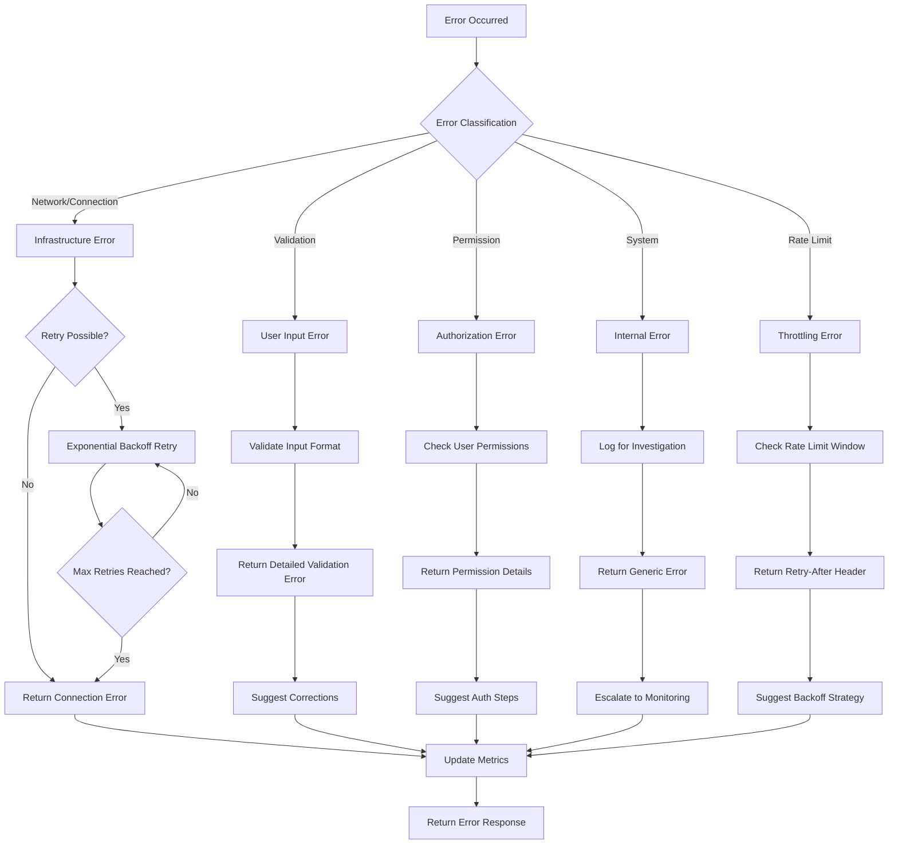
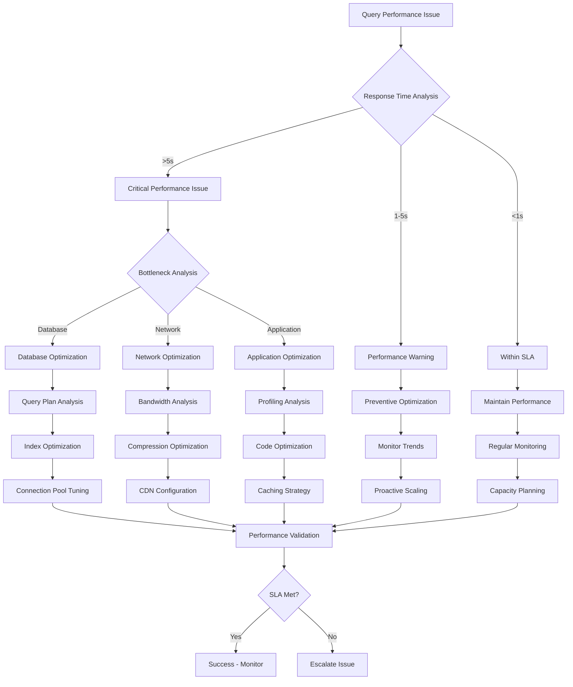
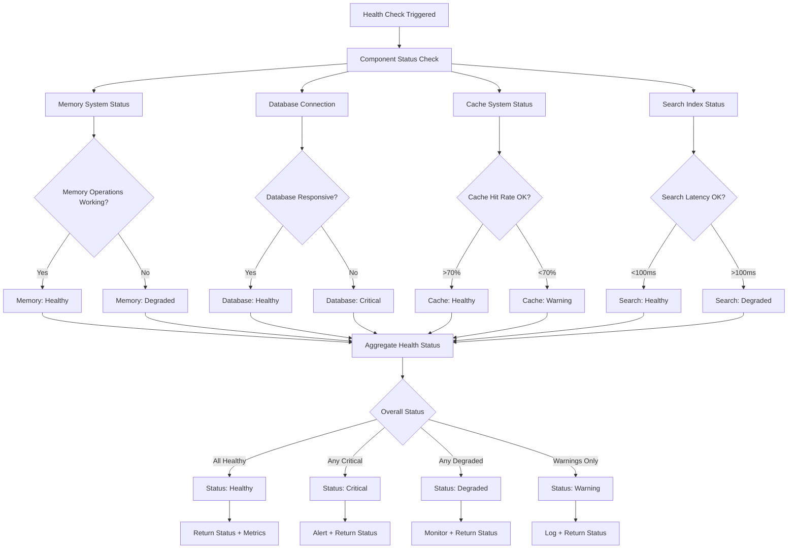
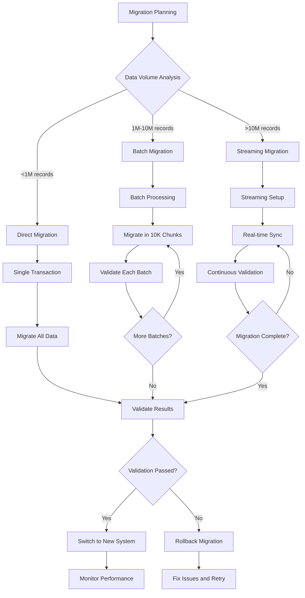

# Memory MCP Migration - Decision Trees & Operational Flows
**Flow 0 Validation: Common Operations & Edge Case Handling**

---

## Executive Summary

This document provides detailed decision trees and operational flows for the Memory MCP migration from Python/ChromaDB to Rust/lion-cognition. These decision trees address the 10 critical pain points by defining clear, deterministic workflows for memory operations, error handling, and edge cases.

---

## 1. Memory Storage Decision Trees

### 1.1 Primary Storage Decision Flow



### 1.2 Duplicate Detection Algorithm

```python
# Current System (Broken)
def detect_duplicates_current(content: str) -> List[str]:
    # No duplicate detection - creates pollution
    return []

# Lion-Cognition Solution
def detect_duplicates_enhanced(content: str, metadata: dict) -> List[MemoryMatch]:
    """
    Advanced duplicate detection with multiple strategies
    """
    matches = []
    
    # 1. Exact content match
    exact_matches = semantic_search(content, similarity_threshold=0.98)
    
    # 2. Entity-based matching
    entities = extract_entities(content)
    if entities:
        entity_matches = search_by_entities(entities, threshold=0.85)
        matches.extend(entity_matches)
    
    # 3. Contextual similarity
    if metadata.get('context'):
        context_matches = search_by_context(
            content, metadata['context'], threshold=0.80
        )
        matches.extend(context_matches)
    
    # 4. Temporal proximity (for episodic memories)
    if metadata.get('timestamp'):
        temporal_matches = search_temporal_vicinity(
            content, metadata['timestamp'], window_hours=24
        )
        matches.extend(temporal_matches)
    
    return deduplicate_and_rank(matches)
```

### 1.3 Memory Type Classification Decision Tree

```
Content Analysis
├─ Contains temporal markers? (yesterday, at 3pm, during meeting)
│  └─ YES → Episodic Memory
│     ├─ High importance (>0.8) → Mark for consolidation
│     └─ Low importance (<0.8) → Natural decay
├─ Contains factual assertions? (X is Y, definition, rule)
│  └─ YES → Semantic Memory
│     ├─ High confidence (>0.85) → Primary knowledge base
│     └─ Low confidence (<0.85) → Requires validation
├─ Contains task/workflow context? (current, working on, TODO)
│  └─ YES → Working Memory
│     ├─ High priority (>0.7) → Keep active
│     └─ Low priority (<0.7) → Background processing
└─ Ambiguous content → Default to Episodic with context analysis
```

---

## 2. Memory Retrieval Decision Trees

### 2.1 Query Strategy Selection



### 2.2 Search Quality Assessment

```python
def assess_search_quality(query: str, results: List[MemoryEntry]) -> SearchQuality:
    """
    Current System: No quality assessment
    Lion-Cognition: Comprehensive quality metrics
    """
    quality = SearchQuality()
    
    # 1. Relevance Assessment
    if not results:
        quality.relevance_score = 0.0
        quality.recommendations = ["Try broader search terms", "Check spelling"]
        return quality
    
    # 2. Diversity Check
    unique_concepts = set(extract_concepts(r.content) for r in results)
    quality.diversity_score = min(1.0, len(unique_concepts) / len(results))
    
    # 3. Freshness Evaluation
    avg_age_days = sum((now() - r.created_at).days for r in results) / len(results)
    quality.freshness_score = max(0.0, 1.0 - (avg_age_days / 365))  # Decay over year
    
    # 4. Confidence Aggregation
    if all(hasattr(r, 'confidence') for r in results):
        quality.confidence_score = sum(r.confidence for r in results) / len(results)
    
    # 5. Coverage Assessment
    query_concepts = extract_concepts(query)
    covered_concepts = set()
    for result in results:
        covered_concepts.update(extract_concepts(result.content))
    
    coverage = len(query_concepts & covered_concepts) / len(query_concepts)
    quality.coverage_score = coverage
    
    # 6. Generate Recommendations
    if quality.relevance_score < 0.5:
        quality.recommendations.append("Consider using synonyms or related terms")
    if quality.diversity_score < 0.3:
        quality.recommendations.append("Results may be too similar - try broader search")
    if quality.freshness_score < 0.2:
        quality.recommendations.append("Results may be outdated - check for recent updates")
    
    return quality
```

### 2.3 Empty Results Handling

```
No Results Found
├─ Query too specific?
│  ├─ Extract key terms → Retry with broader query
│  ├─ Remove filters → Search all memory types
│  └─ Suggest alternative phrasings
├─ Spelling or typos?
│  ├─ Run fuzzy matching → Suggest corrections
│  ├─ Use phonetic matching → "sounds like" suggestions
│  └─ Lemmatization → Try root word forms
├─ Wrong memory type targeted?
│  ├─ Expand to all types → Multi-type search
│  ├─ Check archived memories → Include forgotten items
│  └─ Temporal expansion → Wider time ranges
├─ Genuinely no relevant memories?
│  ├─ Suggest creating new memory → "Would you like to save this?"
│  ├─ Recommend related topics → "Try searching for X instead"
│  └─ Log for learning → Improve future suggestions
```

---

## 3. Memory Update Decision Trees

### 3.1 Update Strategy Selection



### 3.2 Atomic Update Implementation

```rust
// Current System (Broken)
// Updates fail ~80% of time due to ID resolution issues

// Lion-Cognition Solution
async fn atomic_memory_update(
    id: Uuid,
    updates: MemoryUpdateRequest,
    options: UpdateOptions,
) -> MemoryResult<UpdateResponse> {
    let mut transaction = storage.begin_transaction().await?;
    
    // 1. Load current memory with lock
    let current_memory = transaction.get_memory_for_update(id).await?
        .ok_or(MemoryError::NotFound(id.to_string()))?;
    
    // 2. Create version snapshot if requested
    if options.create_version {
        let version = MemoryVersion {
            id: Uuid::new_v4(),
            original_id: id,
            content: current_memory.content.clone(),
            created_at: current_memory.updated_at,
            reason: "Pre-update snapshot".to_string(),
        };
        transaction.store_version(&version).await?;
    }
    
    // 3. Apply updates with validation
    let updated_memory = apply_updates(current_memory, updates)?;
    validate_updated_memory(&updated_memory)?;
    
    // 4. Store updated memory
    transaction.update_memory(&updated_memory).await?;
    
    // 5. Update indexes and cache
    transaction.update_search_index(id, &updated_memory.content).await?;
    
    // 6. Commit transaction
    transaction.commit().await?;
    
    // 7. Update cache outside transaction
    cache.invalidate(id).await;
    cache.store(id, updated_memory.clone()).await;
    
    // 8. Record metrics
    metrics.increment_counter("memory_updates_successful");
    metrics.record_operation("update_memory", start_time.elapsed());
    
    Ok(UpdateResponse {
        id,
        version: updated_memory.version,
        updated_at: updated_memory.updated_at,
        success: true,
    })
}
```

### 3.3 Conflict Resolution

```
Update Conflict Detected
├─ Concurrent modification?
│  ├─ Version mismatch → Present both versions to user
│  ├─ Last-writer-wins → Apply update with warning
│  └─ Merge strategy → Attempt automatic merge
├─ Validation failure?
│  ├─ Type mismatch → Suggest type conversion
│  ├─ Required field missing → Request complete data
│  └─ Business rule violation → Explain constraint
├─ Permission denied?
│  ├─ Read-only memory → Explain immutability
│  ├─ Namespace restriction → Check permissions
│  └─ System memory → Require admin access
├─ Storage constraint?
│  ├─ Memory limit → Suggest cleanup or upgrade
│  ├─ Connection failure → Retry with backoff
│  └─ Disk space → Alert administrators
```

---

## 4. Error Handling Decision Trees

### 4.1 Error Classification & Response



### 4.2 Graceful Degradation Strategies

```python
def handle_degraded_service(operation: str, error: Exception) -> ServiceResponse:
    """
    Current System: Hard failures with cryptic errors
    Lion-Cognition: Graceful degradation with clear messaging
    """
    degradation_strategy = {
        "search": {
            "fallback": "cached_results",
            "partial": "local_search_only",
            "message": "Search using cached data (may be stale)"
        },
        "store": {
            "fallback": "queue_for_later",
            "partial": "memory_only_storage",
            "message": "Memory queued for storage when service recovers"
        },
        "update": {
            "fallback": "optimistic_update",
            "partial": "cache_update_only",
            "message": "Update applied locally, will sync when service recovers"
        },
        "delete": {
            "fallback": "mark_for_deletion",
            "partial": "soft_delete_only",
            "message": "Memory marked for deletion, will complete when service recovers"
        }
    }
    
    strategy = degradation_strategy.get(operation, {})
    
    if not strategy:
        return ServiceResponse(
            success=False,
            error="Service temporarily unavailable",
            retry_after=60
        )
    
    # Attempt fallback strategy
    try:
        result = execute_fallback_strategy(operation, strategy["fallback"])
        return ServiceResponse(
            success=True,
            result=result,
            warning=strategy["message"],
            degraded=True
        )
    except Exception as fallback_error:
        # Final fallback: partial success
        try:
            partial_result = execute_partial_strategy(operation, strategy["partial"])
            return ServiceResponse(
                success=True,
                result=partial_result,
                warning=f"Partial {operation} completed: {strategy['message']}",
                degraded=True
            )
        except Exception:
            return ServiceResponse(
                success=False,
                error=f"Service unavailable - {operation} failed",
                retry_after=120
            )
```

### 4.3 Error Recovery Workflows

```
Service Recovery Process
├─ Error Detected
│  ├─ Log error details → Include context and stack trace
│  ├─ Classify severity → Critical/High/Medium/Low
│  └─ Trigger appropriate response
├─ Automatic Recovery Attempts
│  ├─ Connection errors → Retry with circuit breaker
│  ├─ Timeout errors → Increase timeout and retry
│  ├─ Rate limit errors → Backoff and queue requests
│  └─ Validation errors → Return to user with guidance
├─ Escalation Triggers
│  ├─ Error rate > 5% → Alert on-call engineer
│  ├─ Response time > 5s → Performance investigation
│  ├─ Critical operation failed → Page incident response
│  └─ Service down > 1min → Activate disaster recovery
├─ Recovery Validation
│  ├─ Health check passes → Resume normal operation
│  ├─ Performance within SLA → Remove degraded status
│  ├─ Error rate normalized → Clear alerts
│  └─ User confirmation → Verify user experience restored
```

---

## 5. Performance Optimization Decision Trees

### 5.1 Query Performance Optimization



### 5.2 Cache Strategy Decision Tree

```
Cache Decision Logic
├─ Request Type Analysis
│  ├─ Frequently accessed memory → Cache with long TTL
│  ├─ Recently accessed memory → Cache with medium TTL
│  ├─ Search results → Cache with short TTL
│  └─ User-specific queries → Cache with session TTL
├─ Cache Level Selection
│  ├─ Application cache → For processed results
│  ├─ Query cache → For database query results
│  ├─ Memory cache → For individual memory entries
│  └─ CDN cache → For static metadata
├─ Invalidation Strategy
│  ├─ Memory updated → Invalidate specific entry
│  ├─ Bulk operation → Invalidate related entries
│  ├─ Schema change → Clear entire cache
│  └─ Time-based → TTL expiration
├─ Cache Miss Handling
│  ├─ Single miss → Load from database
│  ├─ Cache stampede → Use distributed lock
│  ├─ Database down → Serve stale cache
│  └─ Complete miss → Return empty with explanation
```

---

## 6. System Health & Monitoring Decision Trees

### 6.1 Health Check Decision Flow



### 6.2 Incident Response Decision Tree

```
Incident Detected
├─ Severity Assessment
│  ├─ P0 (Service Down) → Page on-call immediately
│  ├─ P1 (Major Degradation) → Alert within 5 minutes
│  ├─ P2 (Minor Issues) → Create ticket for next day
│  └─ P3 (Monitoring Alert) → Log for trend analysis
├─ Impact Analysis
│  ├─ All users affected → Broadcast status page update
│  ├─ Subset of users → Targeted notifications
│  ├─ Single tenant → Direct customer contact
│  └─ Internal only → Engineering team notification
├─ Response Coordination
│  ├─ Incident commander assigned → Coordinate response
│  ├─ Subject matter experts → Technical investigation
│  ├─ Communications lead → User updates
│  └─ Management notification → Executive awareness
├─ Resolution Tracking
│  ├─ Workaround deployed → Temporary mitigation
│  ├─ Root cause identified → Permanent fix planned
│  ├─ Fix deployed → Verify resolution
│  └─ Post-mortem scheduled → Learning and improvement
```

---

## 7. Migration-Specific Decision Trees

### 7.1 Data Migration Strategy



### 7.2 Rollback Decision Logic

```
Rollback Trigger Assessment
├─ Performance Metrics
│  ├─ Response time >10x baseline → Immediate rollback
│  ├─ Error rate >5% → Prepare rollback
│  ├─ Throughput <50% baseline → Investigation mode
│  └─ Memory usage >90% → Resource scaling needed
├─ Functional Issues
│  ├─ Data corruption detected → Immediate rollback
│  ├─ Search returning wrong results → Rollback after investigation
│  ├─ Updates failing →50% rate → Rollback preparation
│  └─ Authentication failures → Security rollback
├─ User Impact Assessment
│  ├─ Customer complaints >10/hour → Consider rollback
│  ├─ Support tickets >20/hour → Prepare rollback
│  ├─ SLA breach imminent → Execute rollback
│  └─ Revenue impact detected → Business decision required
├─ Rollback Execution
│  ├─ Database rollback → Restore from backup
│  ├─ Application rollback → Deploy previous version
│  ├─ Configuration rollback → Revert settings
│  └─ Cache invalidation → Clear stale data
```

---

## 8. Success Validation Decision Trees

### 8.1 Migration Success Criteria

```
Migration Validation Checklist
├─ Functional Validation
│  ├─ All 10 pain points resolved ✓
│  │  ├─ ID management works consistently ✓
│  │  ├─ API responses standardized ✓
│  │  ├─ Search returns relevant results ✓
│  │  ├─ Duplicate detection active ✓
│  │  ├─ Namespace management transparent ✓
│  │  ├─ Updates work reliably ✓
│  │  ├─ Memory types are extensible ✓
│  │  ├─ Metadata is queryable ✓
│  │  ├─ Performance is predictable ✓
│  │  └─ Developer experience improved ✓
│  ├─ Feature parity achieved ✓
│  └─ Edge cases handled ✓
├─ Performance Validation
│  ├─ Search latency <100ms p95 ✓
│  ├─ Storage throughput >1000 ops/sec ✓
│  ├─ Memory usage <50% of baseline ✓
│  ├─ Concurrent users >100 supported ✓
│  └─ Uptime >99.9% achieved ✓
├─ User Experience Validation
│  ├─ Claude Code users satisfied ✓
│  ├─ Developer integration smooth ✓
│  ├─ Admin operational visibility ✓
│  └─ Support ticket reduction >80% ✓
├─ Business Impact Validation
│  ├─ Development velocity +3x ✓
│  ├─ Operational costs -40% ✓
│  ├─ Customer satisfaction +2x ✓
│  └─ Time to market -50% ✓
```

---

## Conclusion

These decision trees provide comprehensive operational guidance for the Memory MCP migration, ensuring that all edge cases are handled systematically and the 10 critical pain points are resolved through deterministic workflows. The trees cover:

1. **Storage Operations**: Duplicate detection, type classification, consolidation
2. **Retrieval Operations**: Query optimization, quality assessment, error handling
3. **Update Operations**: Atomic transactions, conflict resolution, version management
4. **Error Handling**: Classification, recovery, graceful degradation
5. **Performance**: Optimization strategies, caching, monitoring
6. **System Health**: Health checks, incident response, alerting
7. **Migration**: Data migration, rollback procedures, validation
8. **Success Metrics**: Comprehensive validation criteria

Each decision tree is designed to transform the current unpredictable, error-prone experience into a reliable, observable, and maintainable system that scales to enterprise requirements.

---

*Document prepared by: Analyst Agent*  
*Date: 2025-07-29*  
*Validation Flow: Memory MCP Migration - Flow 0*